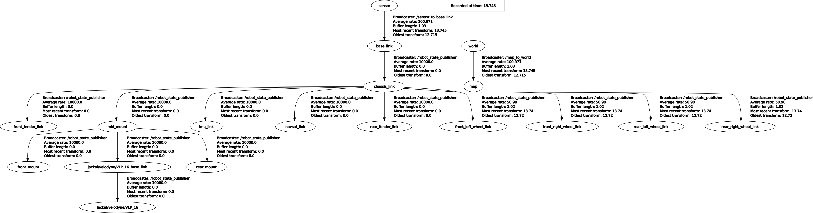

# FAEL: Built Using Docker

## 1. Compose docker

1.1 Download my docker image from docker hub.

```bash
docker pull stephenmao0927/fael:v2
```

1.2  Run the following cmd to disable network access control and enable gui in docker.

```bash
xhost +
```

1.3 Use docker compose to compile the docker.

```bash
cd ~/fael_docker_source/docker
docker-compose -f docker-compose-fael.yml up
```

Remember to modify `source` tag in `docker-compose-fael.yml` according to where the source folder locates on your host.

To enter docker:

```bash
docker exec -it fael_test zsh
```

## 2. Download gazebo models

```zsh
cd .gazebo
git clone https://github.com/osrf/gazebo_models.git
mv gazebo_models models
```

The last step is necessary as `~/.gazebo/models`  is the default path for gazebo to load all the models.

## 3. Compile and Run the demo

```bash
cd
cd catkin_ws
catkin_make
source devel/setup.zsh
```

To run the demo:

```bash
# To launch the env
roslaunch exploration_manager sim_env.launch
# To launch the local planner
roslaunch exploration_manager robot_move.launch
# To start the exploration
roslaunch exploration_manager explorer.launch
```

To run zhongshan demo:

```bash
roslaunch exploration_manager sim_env_zhongshan.launch
```

## Debug log

## 1. Can't get robot odometry when changing simulation environment to Zhongshan's city.world (fixed 2024.2.27)

Reason: The tf tree is broken. There's no transform from `map` to `sensor`, which is supposed to be broadcast by `slam_sim_output`



Solution: (https://github.com/SYSU-RoboticsLab/FAEL/issues/9)

Adding following words to city.env to activate [RotorS](https://github.com/ethz-asl/rotors_simulator).

```xml
<plugin name='ros_interface_plugin' filename='librotors_gazebo_ros_interface_plugin.so'/>
```

## Important Issue:

### 1. How traversability analysis module cooperate with other modules in this algorithm and whether it's possible for us to change it with our own traver_analysis module.

### 2. The planner algorithm and how it can work on a Ackermann-based field robot.

